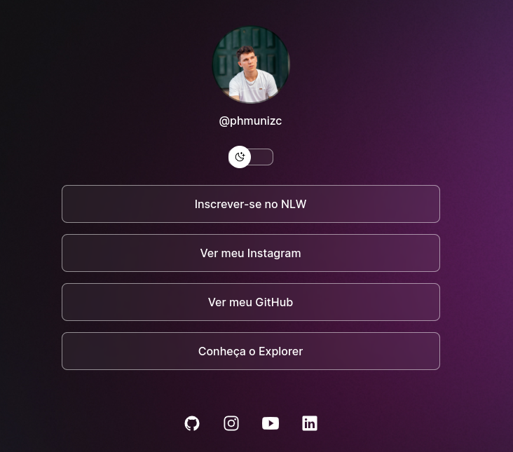
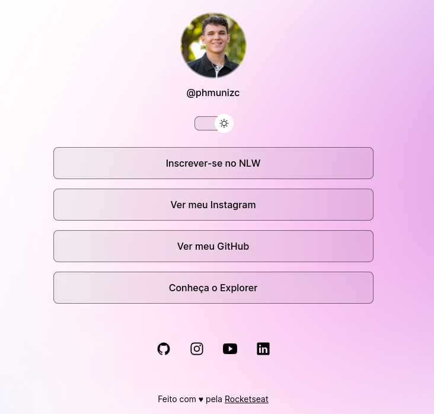

# Projeto Discover
Aqui estão os meus códigos realizados durante o projeto da trilha "Discover" da rocketseat.

Para acessar o site que desenvolvi neste projeto clique <a href="https://phmuniz.github.io/Projeto-DEV-Discover" target="_blank">aqui</a>.

Para este projeto foram utilizadas as seguintes ferramentas:
<ul>
    <li>HTML</li>
    <li>CSS</li>
    <li>Java Script</li>
    <li>Git e GitHub</li>
</ul>
